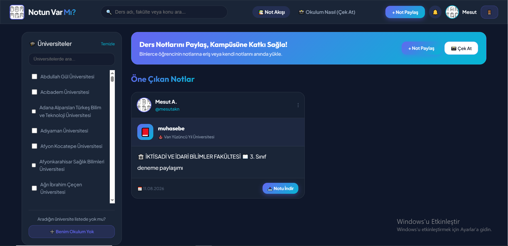
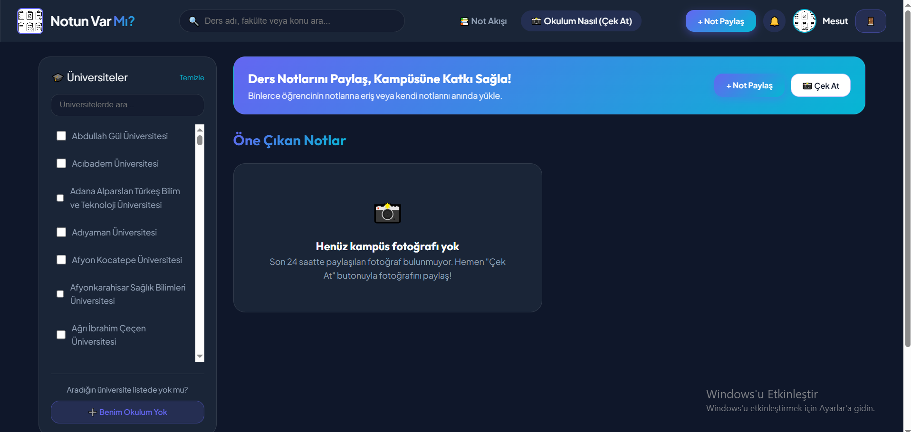
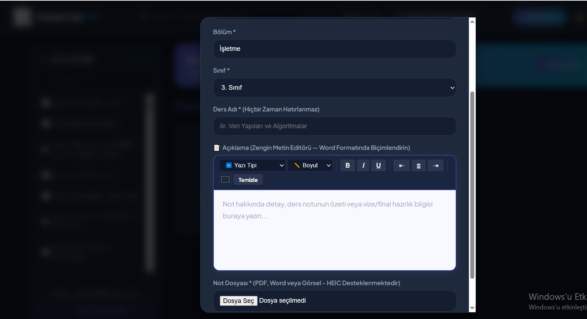

# notun-var-mi
A student-focused platform for discovering, sharing, and accessing academic notes and study materials.

# 📚 Notun Var mı?

A student-focused platform designed to help university students and graduates discover, share, and access academic notes and study materials.

## 📌 About the Project

Notun Var mı? is a web-based platform created to make academic resource sharing more organized and accessible.

Students and graduates can create accounts, share study materials, and search for relevant resources shared by other users.

The platform allows users to filter content based on their university, department, and course, making it easier to find relevant academic materials.

The goal is to create a practical and organized community-driven environment where students can support each other by sharing educational resources.

## ✨ Key Features

- User registration and authentication
- Academic note and resource sharing
- Search and filtering
- University-based filtering
- Department-based filtering
- Course-based filtering
- Organized access to shared study materials
- User-focused interface
- Campus-oriented instant sharing features

## 🛠 Technologies

- PHP
- MySQL
- HTML
- CSS
- Web Development
- Database Design

## 🎯 My Contributions

I have been involved in the development of the project from the concept stage to implementation.

My responsibilities include:

- Project idea and planning
- System design
- Database design
- Web development
- Feature planning
- User experience improvements
- Testing and issue resolution

## 🚧 Project Status

The project is currently approximately **70% complete**.

Current development focuses on improving existing features, resolving remaining issues, and preparing the platform for release.

A mobile version is also planned for future development.

## 📸 Project Preview

  

  

  

## 🔒 Source Code Availability

This repository serves as a portfolio showcase.

The full production source code, private configuration files, credentials, and other sensitive implementation details are not publicly available.

## 👨‍💻 Author

**Mesut Akın**

Aspiring Software Developer

[LinkedIn](https://www.linkedin.com/in/mesut-akin-943b57431/)
